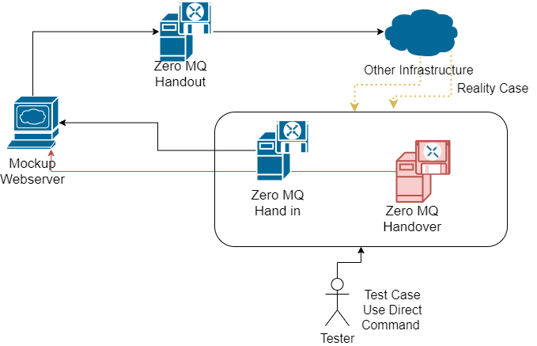

# Mockup API Document

## Dependencies

- Express
- Body Passer
- events
- zero-mq
- socket io
- nodemon (เสริม)
- forever.js (เสริม)

## About Mockup Main Server

Server ตัวนี้ เป็น Server ที่ทำหน้าที่เป็นตัวประมวลผลหลักตัวเดียว มีเพียง 1 ตัว ไม่มี Replication Server ที่เขียนขึ้นมาตัวนี้ เป็น Mockup เพื่อใช้กับการ Test UI แต่ก็มีการเรียกใช้ Zero MQ และ Socket IO จริง ๆ เพียงแต่ว่าไม่ได้ต่อกับตัว Worker Server ที่มี Replication ไม่ได้ต่อกับ Redis ไม่ได้ต่อกับฐานข้อมูลแต่อย่างใด ใน Server ตัวจริง จะมีบางส่วนที่เป็นไปตามงานนี้ แต่ก็มีบางส่วนที่ซับซ้อนขึ้นจากการที่ต้องเชื่อมต่อ Infrastructure ต่าง ๆ

## File

- ไฟล์หลักของ Server อยู่ที่ `main.js`
- Event การเปิดรับคิวจาก Server เข้าไปที่ ZeroMQ เก็บใน `handout.js`
- Event การส่งข้อมูลมาจากคิวของ ZeroMQ ไปที่ Server เก็บในไฟล์ `handin.js`
- Event การส่งข้อมูลมาจากคิวของ ZeroMQ ในแบบที่ผิดพลาด / มีปัญหา มาที่ Server เก็บในไฟล์ `handover.js`

## Queue System

ระบบคิวจะถูกวางไว้ 2 คิว คือ

- **Unprocessed Queue** คือ คิวของ Request ที่ยังไม่ได้ประมวลผล Server นี้จะส่งดำเนินงาน แล้วส่งงานไปที่ Unprocessed Queue
- **Processed Queue** คือ คิว ของ Request ที่ประมวลผลแล้ว งานที่เสร็จแล้ว จะถูกส่งกลับจาก Infrastructure ต่าง ๆ (ในที่นี้จะใช้เป็นการรันไฟล์ handin หรือ handover แทน) เตรียมจะส่งเป็น Server Event กลับไปที่ผู้ใช้

## Test Guild

ในการทำงานเราจะเปิด Server หลักตั้งไว้ก่อน แล้วส่ง REST API มาที่ Server โดยอาจจะส่งผ่านทาง Frontend UI หรือส่งเป็น API ทั้งจาก Postman, Curl หรือ กระบวนการอื่น ๆ ก็ได้ จะมีการประมวลผลต่าง ๆ ตามลำดับ จบที่การส่ง Request Push เข้าไปที่ Unprocessed Queue ของ ZeroMQ

จากนั้น เราจะรัน Hand in หรือ Handover เพื่อทำการป้อนค่าที่ควรจะเปิด (กรณี Hand in) หรือ ค่าที่ไม่ควรจะเป็น (กรณี Handover) มาที่ Processed Queue ที่เราเปิดอยู่ เพื่อดูการตอบสนองของ Server เราต่อไป

> ในกระบวนการจริง หลังจากถูก Push ขึ้นบน Queue แล้ว ข้อมูลจะถูกส่งต่อ และ ดำเนินการผ่าน Infrastructure ที่เหลือ

# Main Server

## Initialize

- มีการสร้าง EventEmitter และ pusherEventLoop จาก event

        const EventEmitter = require("events")
        const pusherEventLoop = new EventEmitter()

- Initial Zero MQ Socket โดยเปิด 2 Socket สำหรับ Push Unprocessed Queue และสำหรับ Pull Processed Queue

        var zmqPushSock = new zmq.Push()
        var zmqPullSock = new zmq.Pull()

  มีการ bind Unprocessed Queue เข้ากับ IP/URL ของ Unprocessed Queue

        zmqPushSock.bind("tcp://127.0.0.1:8090")

- การอนุญาติ Access Control Allow Origin ตามนโยบาย CORS ที่จะอนุญาติให้ API ส่งกันได้บนโดเมนเดียวกัน แต่เนื่องจากเราทำงานบนหลายเครื่อง หลาย IP Address **เพื่อให้ง่าย** จึงเปิดการอนุญาติทุกรูปแบบ

  > จริงๆ แล้ว งาน Production จริง ไม่จำเป็นต้องเปิดหมดทุกตัว ตามหลัก Security ควรจะเปิดเฉพาะสิ่งที่จำเป็น

  **CORS Enable Middleware**

        app.use((req, res, next) => {
        res.header("Access-Control-Allow-Origin", "*")
        res.header(
            "Access-Control-Allow-Methods",
            "POST,GET,PUT,PATCH,DELETE,OPTIONS"
        )
        res.header(
            "Access-Control-Allow-Headers",
            "Content-Type,Option,Authorization"
        )
        next()
        })

- เปิดการใช้งาน `bodyParser` เพื่อที่จะอ่าน Body ของ POST Request ได้ ปกติ มันจะสามารถอ่าน Header ได้อยู่แล้ว ไม่ว่าจะเป็น POST/GET หรือ Method อื่น ๆ แต่มันอ่าน Body ไม่ได้ POST ที่มันมี Body ส่งมาด้วย จึงจำเป็นต้องมีตัวที่จะเอาไว้อ่าน

        app.use(bodyParser.json())
        app.use(
            bodyParser.urlencoded({
            extended: true
            })
        )
