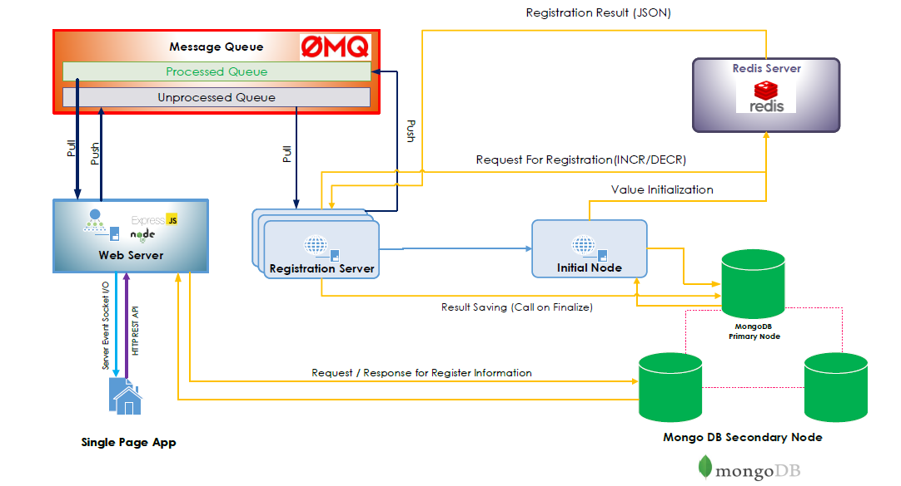

# Subject Registration System with Cluster System

Subject Registration (Demo) Mini Project in 240-410 Internet Programing 1/2019 Gain More Performance, More Avalability and Fault Tolerance of Registration System by using Replication, Queue System and In-Memories Database using Node.js

Chayanon Sukhat, Theethawat Savastham and Yongyuth Ruttana

ดาวน์โหลดสไลด์ [FinalSlide.pdf](FinalSlide.pdf)

## Tech Stack

- Node.js
- Express JS
- React
- MongoDB
- Redis
- Socket.io
- ZeroMQ

## Overall Architecture Illustrator

# Directory

Document ของแต่ละส่วน อยู่ในหน้าของส่วนนั้น ๆ (ใน Directory ของส่วนนั้น ๆ)

- **FrontRegis** เก็บข้อมูลหน้า User Interface ของระบบ ทำงานบนพอร์ต 3000 ซึ่งเขียนด้วย React ทำการค้นหาข้อมูลการลงทะเบียน โดยการส่ง Get Request ไปยังเซิฟเวอร์ ทำการลงทะเบียน โดยการส่ง Post Request ไปยังเซิฟเวอร์ และรับข้อมูลผ่าน Server Event จาก Socket.IO
- **MiniProject_Registration_MockupAPI** เก็บข้อมูล Mockup API เสมือน ที่ใช้ประกอบการสร้าง และ ทดสอบ User Interface โดยจำลองเว็บเซิฟเวอร์บน Express.js ทำหน้าที่ส่งข้อมูลเข้าไปยัง Message Queue, รับข้อมูลจาก Message Queue, ส่ง REST API ข้อมูลการลงทะเบียนให้กับผู้ใช้ , ส่ง Server Event (Socket.IO) กลับมาที่ UI โดยทั้งหมดเป็นข้อมูลที่สร้างขึ้นมาและ เก็บไว้ในไฟล์ `.js` ไม่ได้มีการเข้าถึง Infrastructure ต่าง ๆ
