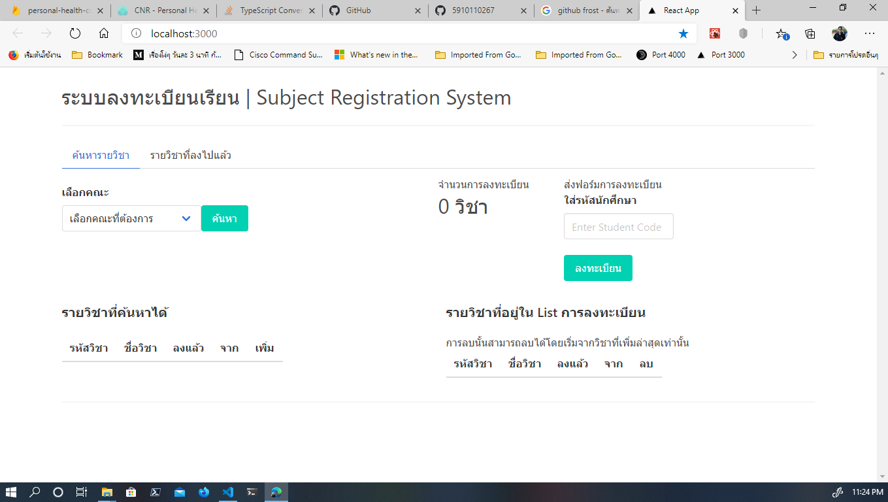

# Registration Frontend

เป็น Single Page App เขียนด้วย React, Javascript โดยมี App.js เป็นตัวหลัก และเชื่อมโยง Component จากโฟลเดอร์ Component โดยเมนูทุกอย่าง จะอยู่ในไฟล์ App.js ทั้งหมด เนื่องจากตอนนั้นยังทำการ Handle Component จาก Children มายัง Parent ไม่เป็น Stack/Dependencies ทั้งหมดในส่วนนี้

- React
- Axios
- Lodash
- Socket.io Client
- Bulma (CSS)

ทดลองรัน Frontend ได้ แต่อาจจะ เชื่อมต่อ Server ทั้งหมดไม่ได้

    npm install
    npm start

## Interface

การทำงานคือ ผู้ใช้จะเข้าไปเลือกคณะ หรือ กลุ่มวิชาที่ต้องการ จากนั้นรายวิชาจะขึ้นมาในวิชาที่ค้นหาได้ ผู้ใช้งานทำการเพิ่ม หรือ ลดวิชาจาก List ในการลงทะเบียน ระบบจำนับจำนวนวิชา เมื่อผู้ใช้ต้องการจะส่งแบบฟอร์มการลงทะเบียน ผู้ใช้จะใส่รหัสนักศึกษา และกดลงทะเบียน

## Searching

การค้นหาอยู่ในไฟล์ `SubjectSearch.js` [SubjectSearch.js](Component/SubjectSearch.js) ซึ่งในส่วนของฟอร์ม จะใช้หลักการใส่ Atrribute `onChange={}` เพื่อเรียกค่าของฟอร์มไปเปลี่ยนค่าของ State ในทุกครั้งที่พิมพ์ ตามหลักของ React และจากนั้นโดยเมื่อฟอร์มส่งไปแล้ว(onSubmit) จะไปนำข้อมูลมาจาก REST API Server ผ่านฟังก์ชัน `onSubmitSearcjFrom`

### ฟังก์ชัน onSubmitSearchForm

มีตัวแปล `baseURL` ไว้สำหรับเก็บ URL เบื้องตันของของ Server จากนั้นจะส่ง `GET` Request โดยนำชื่อคณะที่จะ Search หาวิชา มาต่อท้าย ดัง ก่อนที่จะใช้ Axios เป็นตัวยิง GET Request แล้วนำผลที่ได้จาก request มา `setState` ดังนี้

    let url = baseUrl + this.state.searchFaculty

    Axios.get(url).then(valueRespond => {
        this.setState({ subject: valueRespond.data })
    })

นอกจากนั้น ในฟังก์ชันนี้ จะมีการส่งข้อมูลไป Render ตารางรายวิชา โดยใช้ฟังก์ชัน `renderSubject()` ก่อนจะมาเปลี่ยน state ของ table

     let table = this.renderSubject(this.state.subject, 1)

### ฟังก์ชัน renderSubject()

มีพารามิเตอร์ 2 ตัวคือ State กับ Phase State คือข้อมูลของตาราง ส่วน Phase คือ ตัวเลขที่ใช้กำกับกระบวนการ โดย 1 แทนการเพิ่ม (default) ส่วน 2 จะแทนการลบ (ตอนนั้นไม่เข้าใจเหมือนกันว่าทำไมไม่ใช้ Boolean) นำมาเรียงตาม Subject ID และ นำมา Map ลงไปที่ Table

    renderSubject = (group, phase) => {
        let sortGroup = _.sortBy(group, "SubjectID")

        let displayTable = _.map(sortGroup, subjectinfo => {
            return(<table>
            ...
            </table>)
        }

ในส่วนของ HTML Element ในฟังก์ชันนี้ จะมีปุ่ม โดยปุ่มจะเปลี่ยนเพิ่ม / ลบ โดยอัตโนมัติ

        <button className={phase == 1 ? "button is-primary" : "button is-danger"}
            onClick={() => this.addOrRemoveForRegister(subjectinfo, phase)}>
            {phase == 1 ? "เพิ่ม" : "ลบ"}
        </button>

แล้วนำค่าไปเข้าฟังก์ชั่น `addOrRemoveForRegister()` ซึ่งมีการส่ง Phase ไปเช่นกัน
